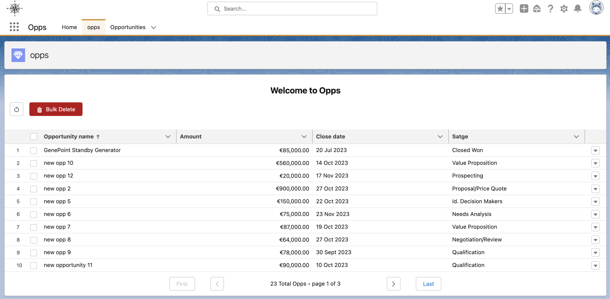
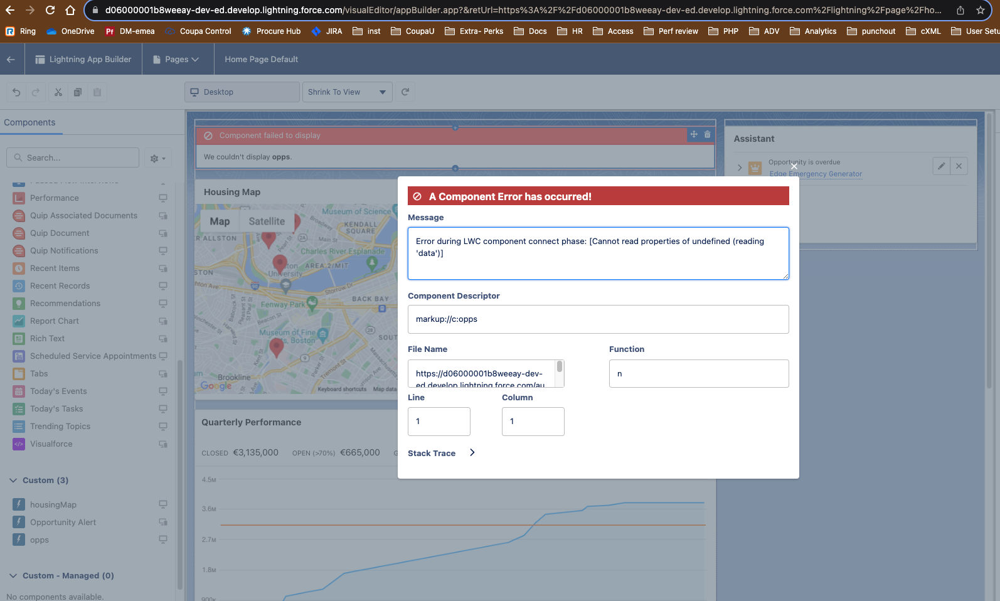

# **salesforce-app**



Link to the Opps app org : **[Opps](https://d06000001b8weeay-dev-ed.develop.lightning.force.com/lightning/n/opps)**.

## Table of Content

* [Project](#Project)
  * [Project Goals](#Project-Goals)
* [Setup](#Setup)
* [Create a Lightning Web Component](#Create-a-Lightning-Web-Component)
* [Create an App, a Page and deploy your LWC](#create-an-app-a-page-and-deploy-your-lwc)
* [Code components](#code-components)
  * [Apex class](#apex-class-oppslistcls)
  * [JavaScript file opps.js](#javascript-file-oppsjs)
* [Bugs](#Bugs)
* [Credit](#credit)

## Project

Sign up for a Developer Edition org here: https://developer.salesforce.com/signup?d=70130000000td6N  
:warning: hotmails email addresses do not work, so please use a gmail address.

All the Salesforce Documentation is here: https://developer.salesforce.com/docs

Trainings and Trailheads are available to look into: https://trailhead.salesforce.com/trails

You will likely find the Apex Developer's Guide, Visualforce Developer Guide, Lightning Aura Components or Lightning Web Components (LWC) guide to be of most benefit.

The project has for aim to see your abilities to understand, review and implement codes within Salesforce features.

There should be some amount of visualforce and apex involved in this project.

### Project Goals

* :white_check_mark: Create a page(visualforce)/application(aura,LWC) that lists standard or custom objects (you can choose what object to list)
* :white_check_mark: The list can have several column headers (name, created date, etc, of your choice)
* :white_check_mark: The list can be sortable by any of these column headers (e.g. sort by created date)  
:star: Bonus: Add visual indication (e.g. ▲ or ▼) on clicked column to display sorting direction
Clicking on the same column header repeatedly will reverse the order of sorting
* :white_check_mark: The list is paginated; users can cycle between X number of rows by using custom links or buttons. First, Last, Previous, and Next pagination actions are required, and their corresponding custom button/link should be enabled only if action can be performed.  
:star: Bonus: Display current page number and total pages.
* :white_check_mark: The list is interactive: the user can perform an action on each row of the list (click a button or select a checkbox on each row); a separate action button will perform some action on each of the selected rows.

:spiral_notepad: Note: To achieve this you should look into using a custom controller or extension controller.

## Setup

### Set Up Your Computer and Your Lightning Web Components Developer Tools

* Install Salesforce CLI :arrow_right: https://developer.salesforce.com/tools/salesforcecli
* Install VScode studio :arrow_right: https://code.visualstudio.com/
* Install the long-term support (Active LTS) version of Node.js on your computer :arrow_right: https://nodejs.org/en/download/. To confirm the successful installation run node --version
* Install "Salesforce extension pack" from the extension tab and click install.

### Create a Project, Connect VScode to your dev hub and create an org scratch

Everything is in the following Trailhead [Create a Lightning Web Component](https://trailhead.salesforce.com/content/learn/projects/set-up-your-lightning-web-components-developer-tools/create-a-lightning-web-component)

> A scratch org is a dedicated, configurable, and short-term Salesforce environment that you can quickly spin up when starting a new project, a new feature branch, or a feature test.
> A Developer Hub (Dev Hub) is the main Salesforce org that you and your team use to create and manage your scratch orgs.

#### Create a project

1. In VScode, open the Command Palette by pressing Ctrl+Shift+P (Windows) or Cmd+Shift+P (macOS/Linux).
2. Type SFDX.
3. Select ```SFDX: Create Project```.
4. Press Enter to accept the Standard option.
5. Enter Opps as the project name.
6. Select a folder on your device to store the project.

#### Authorize Your Dev Hub

The next step is to authenticate Dev Hub. If you're using a Trailhead Playground you can learn in [Get Your Trailhead Playground Username and Password](https://trailhead.salesforce.com/en/content/learn/modules/trailhead_playground_management/get-your-trailhead-playground-username-and-password) how to get the credentials for the next step.

This is a pre-requisite for creating a scratch org.

1. In VSCode, press Command + Shift + P on macOS or Ctrl + Shift + P on Windows or Linux.
2. Type sfdx.
3. Select SFDX: Authorize a Dev Hub.
4. Log in using your Dev Hub org credentials.
5. Click Allow when asked to allow access.

#### Create your org

1. Open the Command Palette and enter ```SFDX: Authorize an Org```.
2. Choose Production in the next screen and then provide an org alias (for example devOrg).
3. Your browser opens a Salesforce login page.
4. Enter your credentials for your Trailhead Playground org.
5. If prompted, click Allow, to allow Salesforce CLI to perform actions against your org, such as code deploy.

Your project is now connected to the Trailhead Playground, and you can use ```sf org open``` command to open the org.

## Create a Lightning Web Component

1. In VS Code, under the ```force-app/main/default```, right-click the ```lwc``` folder
2. Select ```SFDX: Create Lightning Web Component```.
3. Name the Lightning web component, (I choose Opps), andß select the ```main/default/lwc``` directory.

The same can be achieved from the terminal:

1. Open the command palette and select ```enter focus terminal```.
2. Paste the following ```sf lightning generate component -n myFirstWebComponent -d force-app/main/default/lwc --type lwc```
3. Press enter

This will create all needed files for the LWC

```-n``` — This defines the name of the Lightning web component folder and its files.  
```-d``` — This defines the target directory where the Lightning web component should be created. The target directory must be named lwc  
```--type``` — This specifies that you want to create a Lightning Web Component.

Save the files and right-click on the ```lwc``` folder and select ```SFDX: Deploy Source to Org```.

## Create an App, a Page and deploy your LWC

### Create a lightning App

1. In your org click Setup and then select Setup.
2. In the Quick Find box, type App Manager, then select App Manager.
3. Click New Lightning App on the top right of the page.
4. In the App Details & Branding window, choose the name of your app, the logo and colour theme.
5. On the App Options screen, select Standard navigation, then click Next.
6. On the Utility Items screen, click Next.
7. On the Navigation Items screen, select Home, Opportunities, Top Account and Opportunities from the Available Items list, and move them to the Selected Items list using the arrow. Then click Next.

### Create a Lightning Page

All the steps are found in the following Trailhead [Lightning app builder](https://trailhead.salesforce.com/content/learn/modules/lightning_app_builder)

1. In your org click Setup and then select Setup.
2. In the Quick Find box, type App Builder, then select Lightning App Builder.
3. Click on the ```New``` button in the Lightning Pages table.
4. Select App Page and click next.
5. Name your app and click next.
6. Choose your preferred layout (here I selected One Region) and click on done.
7. Drag and drop you LWC on the canvas and click Save.
8. Select Activate now.
9. Name your page, select where it should be available.

## Code components

### HTML

* HTML provides the structure for the component.
* Lightning web component HTML files all include the ```template``` tag.
* The ```template``` tag contains the HTML that defines the structure of your component.

### Jvascript

* JavaScript defines the core business logic and event handling.
* Export:
  * AllOpps is the name I have assigned to my component class.
  * The export statement defines a class that extends the LightningElement class. As a best practice, the name of the class usually matches the file name of the JavaScript class, but it's not a requirement.
* Modules:
  * Lightning Web Components uses modules (built-in modules were introduced in ECMAScript 6) to bundle core functionality and make it accessible to the JavaScript in your component file. The core module for Lightning web components is lwc.
  * Begin the module with the import statement and specify the functionality of the module that your component uses.
  * The import statement indicates the JavaScript uses the LightningElement functionality from the lwc module.
* In the .js file, we often use the this keyword. The this keyword in JavaScript refers to the top level of the current context. Here, the context is this class.
* Decorator:
  * You can import multiple decorators, but a single property or function can have only one decorator. For example, a property can't have @api and @wire decorators.
    * @wire: Gives you an easy way to get and bind data from a Salesforce org.
    * @api: Makes a component or method public which makes it accessible from other component (parent, child ...).

### .js-meta.xml

* XML defines the metadata for Salesforce, including the design configuration for components intended for use in Lightning App Builder
* ```apiVersion``` binds the component to a Salesforce API version.
* ```isExposed``` (```true``` or ```false```) If ```isExposed``` is ```false```, the component isn't exposed to Lightning App Builder or Experience Builder.
  * To allow the component to be used in Lightning App Builder or Experience Builder, set ```isExposed``` to ``true`` and define at least one ```<target>```, which is a type of Lightning page.
  * ```targets``` specify which types of Lightning pages the component can be added to in the Lightning App Builder.

### Apex Class OppsList.cls

In Visual Studio Code, under ```force-app/main/default```, right-click on the ```classes``` sub-folder and select ```SFDX: Create Apex Class```.

In this project, I created a class **OppsList** that has several methods.  
The query compiles and thus is type-checked at compile time.

### Code Highlights
  
* ```apex
  public static List<Opportunity> getOppsList(){
      try {
          // Create a list of opportunities records from a SOQL query
          List<Opportunity> opportunityList = [
              SELECT
              id,
              Name,
              Account.Name,
              Amount,
              CloseDate,
              StageName,
              OwnerId
              FROM Opportunity
              WITH SECURITY_ENFORCED
              ORDER BY Name
          ];


          // Maybe create 2 custom field on the opportunity object and get the account name and cast it in the custom field
          // Likewise for the Username, but there is not parent/child relationship so might need to get the corresponding Users in a query
          // List<String> accountNameList;


          // for (Opportunity opp : opportunityList) {
          //     accountNameList.add(opp.Account.Name);
          // } 

          return opportunityList;
          
      } catch (Exception e) {
          // Exception handling
          throw new AuraHandledException(e.getMessage());
      }
  }
  ```
  * The method ```getOppsList()``` returns the list of opportunities records (as an Array) by querying the Opportunity object.
  * I used SOQL to write the queries referencing the object and the fields on the object.

* ```apex
  // credit https://gist.github.com/sohalloran/5be1daf94a2d4e8fcd92df2cf6988e62
  @AuraEnabled(cacheable=true)
  public static Integer getAllOpps(){
      return [ SELECT COUNT() FROM Opportunity WITH SECURITY_ENFORCED ];
  }
  ```
  * The Method ```getAllOpps()``` returns the count of all the opportunities.
  * This is used for the pagination functionality.

* ```apex
  // update opp
  @AuraEnabled
  public static void updateOpp(List<Opportunity> oppToUpdate) {
      update oppToUpdate;
  }
  ```
  * The method ```updateOpp()``` use the update SOQL DML operation to update records in the database.
  * An array (*oppToUpdate*) is passed to the method which is the array of records and fields to update.

* ```apex
  // delete opp 
  @AuraEnabled
  public static void deleteOpp(List<Opportunity> oppToDelete){
      delete oppToDelete;
  }
  ```
  * The method ```deleteOpp()``` use the delete SOQL DML operation to delete records in the database.
  * An array (*oppToDelete*) is passed to the method which is the array of records to delete.

Follow the steps below to create an anonymous script to test the apex class.

* Create a new file <your_file_name>.apex in the scripts/apex folder.
* Replace the contents of the file with the following code: System.debug(<your_class_name>.<your_method>()); :arrow_right: ```System.debug(OppsList.getOppsList());```
* Open the Command Palette by pressing Ctrl+Shift+P (Windows) or Cmd+Shift+P (macOS/Linux) and type/select ```Execute Anonymous Apex```.

### JavaScript file opps.js

* Import LightningElement and wire from the lwc engine.
* Import the apex methods defined in OppsList that we are using in this file.
* I have used @wire decorator to bind the data returned from the apex call to the lwc component.
* I have implemented getter method to set component attribute and variables such as:
  * page data
  * current page number
  * total count of opportunity records
  * total pages based on displaying 10 records per page
  * first page and last page attribute set to false or right depending on the page number compared to the total number of pages.
* I have implemented methods to:
  * navigate through pages of records
  * reset the app
  * delete single row
  * bulk delete selected rows

### HTML file opps.html

* Template tag for lwc structure.
* Lightning-card that envelope all the other components.
* Two different templates, one to display if data is returned and one to display if error is returned.
* lightning-button-group
  * one button to refresh the page.
  * one button used for bulk delete.
* lightning-datatable to display the data.
* Pagination:
  * first and last page buttons.
  * previous and next buttons.
  * information on the current page number, total page number and total records.

## Bugs

### No data returned

  
Cannot read data of undefined.  

* Issue:
  * I was returning opportunityList method instead of getOppsList using @wire.  
* Solution:
  * When using the declarative/imperative way of returning data from the apex class it needed to be ```opportunityList({error, data}){...}```.

### Invalid action parameters

  
Value provided is invalid for action parameters 'oppToDelete' of type 'List'  

* Issue:
  * I was passing an object instead of a list to the ```deleteOpp()``` method.
* Solution:
  * Changed the JavaScript method to convert object to list, i.e. changed the parameter passed from ```row``` to ```[row]```.

### Sorting not working

* Issue:
  * Sorting on opportunity name was not working correctly.
  * The comparison of uppercase and lower case letter which holds different values in ascii caused a sorting issue.
* Solution:
  * Add toUpperCase() method in order to compare with same data: ```return a[fieldname].toUpperCase()```.

* Issue:
  * The above fix created a bug upon sorting on the amount column.
  * Conversion to uppercase does not work for currencies, i.e. integer values.
* Solution:
  * Add a conditional statement to check on which column it is sorting on: ```return fieldname !== 'Amount' ? a[fieldname].toUpperCase() : a[fieldname];```.

## Credit

### Content

* Credit to https://gist.github.com/sohalloran/5be1daf94a2d4e8fcd92df2cf6988e62 for the count Apex method.
* Credit to https://www.apexhours.com/lightning-datatable-sorting-in-lightning-web-components/ for the sortData method.
* Credit to https://studio.webcomponents.dev/edit/88mc3Gx8E4OZNksS14kZ/src/app.html?p=stories for pagination help.

### Documentation

#### Trailheads

* https://trailhead.salesforce.com/content/learn/modules/lightning-web-components-basics/discover-lightning-web-components?trail_id=force_com_dev_beginner
  * LWC basics.
  * Decorator.
  * Modules.
* https://trailhead.salesforce.com/content/learn/projects/get-started-with-salesforce-development/write-business-logic-in-apex?trail_id=force_com_dev_beginner
  * Build base class to query data.
* https://trailhead.salesforce.com/content/learn/modules/apex_database/apex_database_dml
  * Data Manipulation Language DML statement.
* https://trailhead.salesforce.com/content/learn/modules/lightning-web-components-and-salesforce-data/use-apex-to-work-with-data?trail_id=build-lightning-web-components&trailmix_creator_id=sakthivel&trailmix_slug=lightning-web-component-lwc
  * Working with LWC and Apex.

#### Developer

* https://developer.salesforce.com/docs/platform/lwc/guide/js-props-getters-setters.html
  * Getter setter functions.
* https://www.lightningdesignsystem.com/utilities/
  * Style classes.
* https://developer.salesforce.com/docs/component-library/overview/components
  * Component library.
* https://developer.salesforce.com/docs/component-library/bundle/lightning:datatable/documentation
  * Datatable.
* https://github.com/trailheadapps/lwc-recipes/tree/main/force-app/main/default/lwc
  * lwc-recipes project for pagination and general project reference.